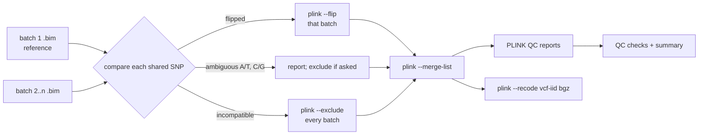

# GWAS Data Preparation

[](https://github.com/dsugurtuna/gwas-data-preparation/actions/workflows/ci.yml)

Merge genotyping batches with explicit strand checks, apply standard GWAS quality control from PLINK 1.9 reports, and convert to VCF without losing sample IDs or reference alleles.

> **Portfolio project.** Built as a generalised demonstration of GWAS preparation workflows. No real participant data is included.

## The problem

Preparing array data for a genome-wide association study means merging batches that may not agree on strand, removing poor variants and samples with the usual QC filters, and handing over files that other tools read correctly. Each step has a well-known trap: blind strand flips, related samples left in, VCF sample IDs silently split at an underscore.

## What this does

- **Strand check before merging.** Compares each batch's `.bim` with the first batch and sorts shared SNPs into flipped (fixed with `plink --flip` on that batch only), ambiguous A/T and C/G (reported, optionally excluded) and incompatible (excluded). Then merges once with `plink --merge-list`.
- **QC from PLINK reports.** Variant and sample call rate (`--missing`), minor allele frequency (`--freq`), Hardy-Weinberg (`--hardy`, all samples or controls only), heterozygosity outliers (`--het`), sex discordance (`--check-sex`) and relatedness (`--genome`, removing as few samples as possible), plus a summary that counts each removal once.
- **VCF conversion** with `--double-id` on import and `--recode vcf-iid --keep-allele-order` on export.

## Quickstart

Runs on the synthetic PLINK report files in [`examples/`](examples/README.md); PLINK is not needed for this.

```bash
git clone https://github.com/dsugurtuna/gwas-data-preparation.git
cd gwas-data-preparation
python3.11 -m venv .venv && source .venv/bin/activate
pip install -e ".[dev]"
pytest
python examples/qc_demo.py
```

Output (every failure is planted in the synthetic data):

```text
variant call_rate       ['rs100007']
variant maf             ['rs100021', 'rs100022']
variant hwe             ['rs100033']
sample call_rate       ['SYN013']
sample heterozygosity  ['SYN027']
sample sex             ['SYN031']
sample relatedness     ['SYN004']
variants kept 56/60, samples kept 36/40
strand: flipped ['rs1'], ambiguous ['rs3'], incompatible ['rs4']
```

Merging and conversion call PLINK 1.9 (`plink` on the `PATH`, or pass `plink_path`):

```python
from gwas_prep import FormatConverter, GenotypeAssembler

result = GenotypeAssembler(work_dir="work").merge_batches(
    ["batch1", "batch2", "batch3"], "merged", exclude_ambiguous=False
)
print(result.success, result.strand_flips, result.excluded_variants)
FormatConverter().plink_to_vcf("merged", "merged.vcf.gz")
```

## How it works



## Design decisions

- **Decide flips from the alleles, per batch.** PLINK's usual recovery (flip everything in `.missnp`, retry, then exclude) is fine for two datasets, but with several batches it can flip a SNP in a batch that was already right. Comparing each batch with one reference avoids that.
- **Ambiguous SNPs are reported, not silently dropped.** For batches from one array and one pipeline they are usually fine; across arrays they are a real risk. The caller decides with `exclude_ambiguous`.
- **Columns by header name.** PLINK pads its reports with spaces and column positions differ between commands, so every parser looks columns up by name.
- **Relatedness by greedy removal.** Removing the sample involved in the most related pairs first keeps more of the cohort than dropping one member of each pair at random.
- **HWE in controls on request.** In a case-control study, testing HWE in cases can remove genuine association signals, so `check_hwe(..., test="UNAFF")` is available.
- **PLINK runs through an injectable runner,** so the merge plan and command lines are tested without PLINK installed.

## Limitations and what it is not

- It does not run the PLINK QC commands for you; it reads their output.
- Ambiguous SNPs are not resolved by allele frequency; they are only reported or removed.
- Relatedness removal ignores phenotype and call rate when choosing whom to drop.
- Population structure (principal components, ancestry outliers) is not covered.
- Multi-allelic variants are out of scope, as they are for PLINK 1.9.

## Where this fits

Upstream of association analysis and of the HLA work in [hla-pipeline-manager](https://github.com/dsugurtuna/hla-pipeline-manager). Format conversion is covered in more depth, with validation, in [vcf-plink-converter](https://github.com/dsugurtuna/vcf-plink-converter); sample and variant QC for sequencing data is in [genomic-qc-toolkit](https://github.com/dsugurtuna/genomic-qc-toolkit).

## Roadmap

- Resolve ambiguous SNPs by comparing allele frequencies with the reference batch.
- Add principal-component ancestry checks.
- Prefer the sample with the lower call rate when breaking relatedness ties.

## Jira provenance

| Ticket | Description |
| :--- | :--- |
| BIOIN-618 | GWAS data preparation and delivery for academic collaborators |

## Licence

MIT is declared in `pyproject.toml`, but no licence file is included yet.

---

Personal project by [Ugur Tuna](https://github.com/dsugurtuna). Not affiliated with or endorsed by any employer.
